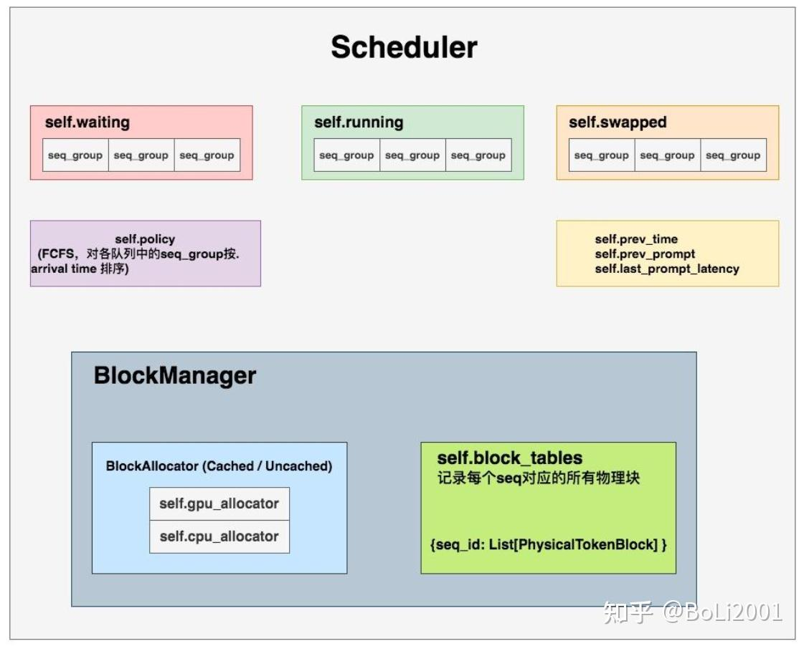

# 主要流程

## 启动Serve

下面是是执行 `ppython3 -m vllm.entrypoints.cli.main serve intfloat/e5-mistral-7b-instruct --trust-remote-code --task embed` 命令启动之后
到达 `LlamaForCausalLM` 的线程栈截图；

调用API进入模型处理之前。

启动子进程之前.

## Scheduler
调度器下维护着 BlockSpaceManager。它负责管理BlockAllocator（实际参与分配物理块的类）。BlockAllocator又分成gpu和cpu两种类型，分别管理这两类设备上的物理块。

## Distributed Workers
Distributed Workers，也就是分布式系统，Worker 是运行 model 的单位，对于每个 device（也即每张卡）创建一个 Worker，一个worker负责维护一
张GPU上的kv cache和该GPU上的执行。它将我们要使用的模型load到各块卡上（目前对单卡装不下的模型，vLLM支持tp/pp推理），然后对Controller传来的
数据做1次推理，返回相关结果。一个 LLMEngine 管理所有的 workers。

在每个Worker实例中又管控着如下两个重要实例：
- CacheEngine：负责管控gpu/cpu上的KV cache物理块（调度器的block manager只负责物理块id的分配，CacheEngine则是根据这个id分配结果实打实地在管理物理块中的数据）
- Worker.model：即vLLM代码中的model_runner。它负责加载模型，并执行推理。PagedAttention的相关逻辑，就在这个实例关联的代码下。

## CacheEngine
CacheEngine给GPU分配空间的方式是：CacheEngine是通过pytorch的接口在gpu上分配对应大小的tensor来作为物理块的空间的，而不是直接使用cudaMalloc进行操作的。

它根据Transformer的层数分配对应数目的tensor，比如Transformer有12层，那么gpu_cache就是一个有12个tensor的list。每个tensor的大小是2 *
物理块个数 * （一个物理块中的token个数 * 每个token的hidden_dim的维度），所以这里每个tensor的大小为 2 * 473 * 16 * 768。这12个tensor以后就被用来当做kv cache 了。

Scheduler中还维护着vLLM自定义的一个Policy实例，目标是根据调度器总策略（FCFS，First Come First Serve，先来先服务）原则，对各个队列里的seq_group按照其arrival time进行排序。

