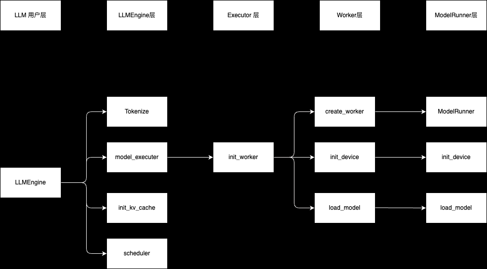

模块
* Entrypoint
* Engine模块：LLMEngine
* Core模块：[scheduler.py](../vllm/core/scheduler.py)
  * batch size
* Kv cache manager: [block_manager.py](../vllm/core/block_manager.py)
  * Paged Attention <--- LMCache
* Worker：初始化一些环境
  * [worker](../vllm/worker) 硬件和软件的交汇点上
  * 不搞硬件只需要看下面两个类
    * [worker.py](../vllm/worker/worker.py) gpu
    * [worker_base.py](../vllm/worker/worker_base.py)
* Model executor：model包了一层壳
  * [model_executor](../vllm/model_executor)
  * [llama.py](../vllm/model_executor/models/llama.py) # 推荐阅读这个文件
* Modelling
  * 把其它模型适配到vllm，这是最难的。
  * 最核心的是 forward 函数
* Attention backend <-- LLM 中最核心的东西‘
  * [attention](../vllm/attention)
  * [flash_attn.py](../vllm/attention/backends/flash_attn.py)

周边
* Preprocessing

优化

* [evictor.py](../vllm/core/evictor.py)evictor.py: 用于定义不同的缓存驱逐策略
  * Prefix caching: 前缀缓存 <----(CacheBlend 不同前缀共享缓存：What if prefix doesn't match?,
    CacheBlend. What if prefix cache on another machine? KV cache sharing across nodes.
    https://github.com/LMCache/LMCache)
    * EvictionPolicy 是一个枚举类，用于定义不同的缓存驱逐策略。当前代码中定义了一个策略 LRU（Least Recently Used，最近最少使用）。
    * 这个枚举类用于 make_evictor 函数中，根据传入的驱逐策略实例化相应的 Evictor 子类。

## Feature
* Distributed inference
  * Why distributed inference?: 一张卡放不下
  * Types of distributed inference: TP/PP/EP
  * PD Disaggregation
* Prefix caching
* Speculative decoding
* Benchmarking

